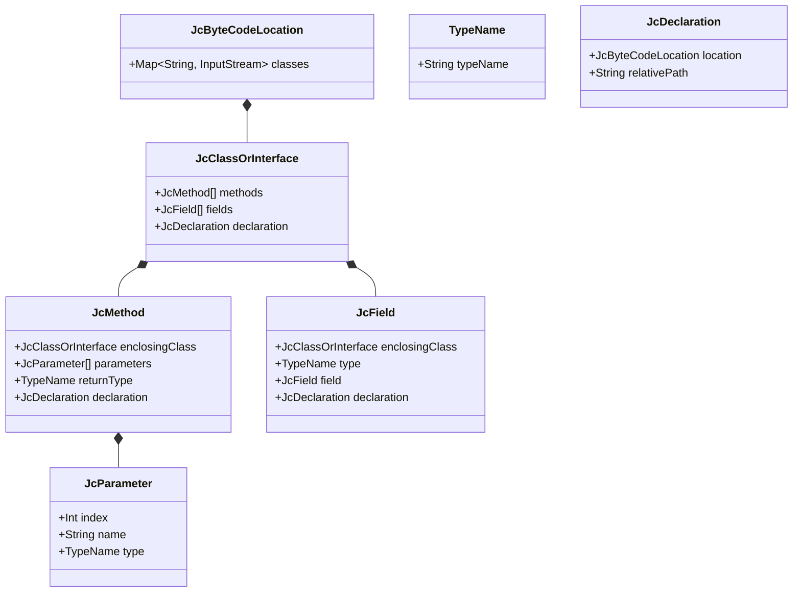
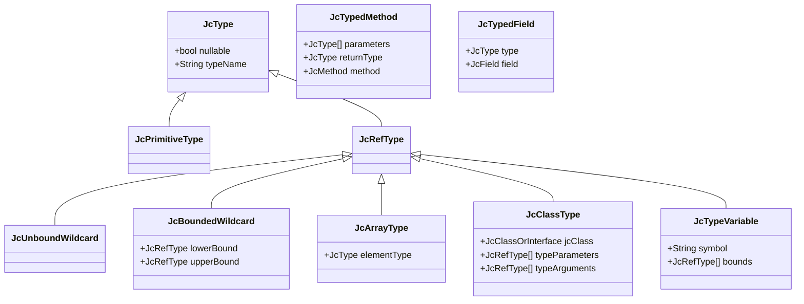

## Classes

`JcClassOrInterface` represents class file. As a result there is no `JcClassOrInterface`s for arrays and primitives.

## Types

`JcType` represents type from JVM runtime.

`JcClasspath` is an entry point for both **classes** and **types**.

`JcClassType#methods` contains:

* all the public/protected/private methods of an enclosing class
* all the ancestor methods visible at compile time
* only constructor methods from the declaring class

`JcClassType#fields` contains:

* all the public/protected/private fields of an enclosing class
* all the ancestor fields visible at compile time

